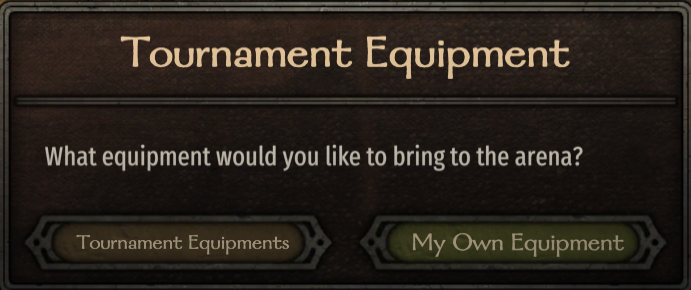
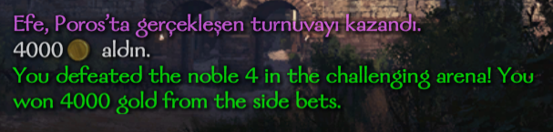
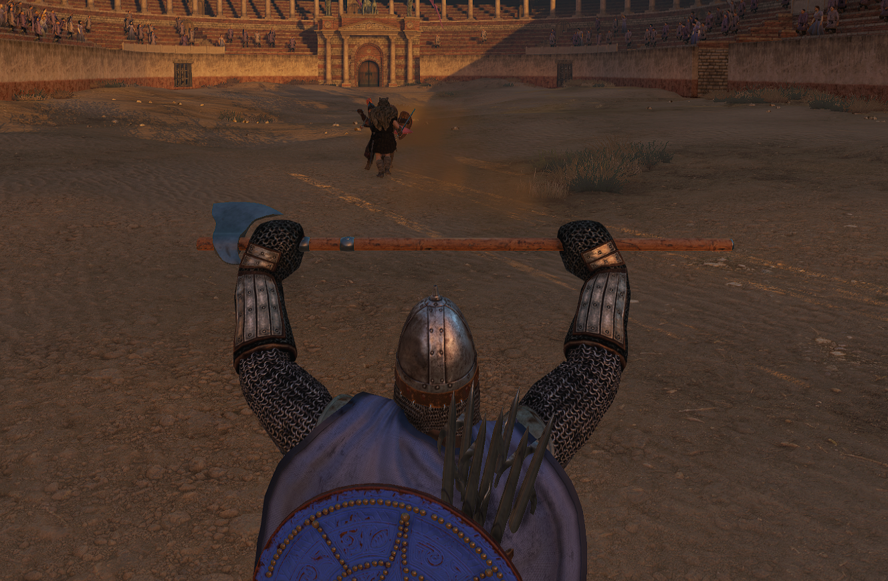

# ⚔️ EfeTournamentMod
Bu repositoryde Mount & Blade II: Bannerlord oyununda bulunan turnuva modu için yaptığım modlar bulunmaktadır.

## 🗡️ Modlar
### 🛡️ Kendi Ekipmanınla Turnuvaya Gir
`TournamentEquipmentPatch.cs` · `TournamentMenuPatch.cs`
Turnuvaya katılmadan önce oyuncuya bir seçim sunulur: standart turnuva ekipmanlarıyla mı, yoksa envanterindeki kendi silah ve zırhlarınla mı savaşmak istediğini seçebilirsin. 

### 💰 Lord Sayısına Göre Dinamik Ödül Sistemi
`TournamentRewardPatch.cs`
Turnuvada ne kadar çok lord varsa, maç sonu ödülü o kadar değerli olur. Bu mod sayesinde küçük turnuvalar ile büyük şehirlerdeki prestijli müsabakalar arasında anlamlı bir fark oluşur; her zafer gerçek anlamda kazanılmış hissettirmeye başlar.

## ⚙️ Kurulum
1. `modefiles/EfeTournamentMod` klasörünü `Modules/` dizinine kopyala (modefiles atılmayacak yalnızca EfeTournamentMod kopyalanacak!!)
2. Launcherdan modu etkinleştir
3. Arenaya gir.

## 📸 Görseller/Images
| | | |
|---|---|---|
|  |  |  |

---

# ⚔️ EfeTournamentMod
This repository contains mods I made for the tournament system in Mount & Blade II: Bannerlord.

## 🗡️ Mods
### 🛡️ Enter the Tournament with Your Own Equipment
`TournamentEquipmentPatch.cs` · `TournamentMenuPatch.cs`
Before joining a tournament, the player is given a choice: fight with standard tournament equipment, or enter the arena with your own weapons and armor from your inventory.

### 💰 Dynamic Reward System Based on Lord Count
`TournamentRewardPatch.cs`
The more lords present in a tournament, the more valuable the end-of-match reward. This mod creates a meaningful difference between small town tournaments and prestigious competitions in major cities; every victory starts to feel truly earned.

## ⚙️ Installation
1. Copy the `EfeTournamentMod` folder inside `modefiles/` into your `Modules/` directory (do not copy modefiles itself, only EfeTournamentMod!)
2. Enable the mod from the Launcher
3. Enter the arena.

